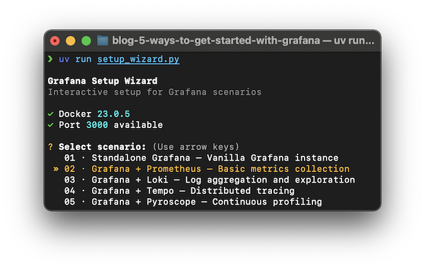

# 5 ways to get started with Grafana

This repository contains a collection of resources and examples to back up the blog post "5 ways to get started with Grafana".
Click [here](https://quesma.com/blog-detail/five-docker-examples-for-grafana-to-get-started-with-metrics-logs-and-traces) to read the blog post.


Each of the subdirectories in this repository corresponds to a specific example, showcasing a different local Grafana setup.
Follow instructions in the respective `README.md` files within each subdirectory to set up and run the examples.


##### (optional) Interactive wizard to run these examples
Alternatively, use the interactive wizard to set up and run any of the examples with a single command via [uv](https://docs.astral.sh/uv/guides/scripts/).

```bash
uv run setup_wizard.py
```


